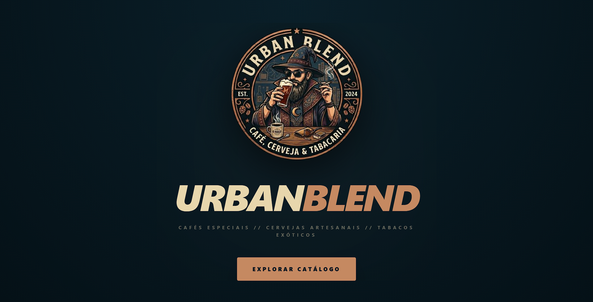
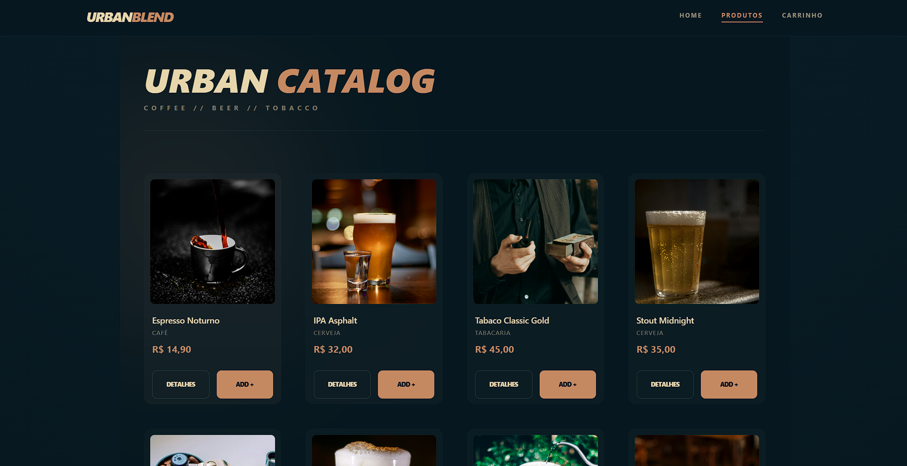

# Urban Blend

Projeto front-end para o Urban Blend, uma loja virtual de cafés, cervejas e kits urbanos. 

## Preview do Projeto



## Funcionalidades
- Listagem de produtos
- Carrinho de compras
- Checkout
- Visualização detalhada de produtos

## Tecnologias Utilizadas
- Vue 3 + Vite
- TypeScript
- Pinia (gerenciamento de estado)
- Vue Router
- TailwindCSS

## Como rodar o projeto

1. Instale as dependências:
   ```bash
   npm install
   ```
2. Rode o servidor de desenvolvimento:
   ```bash
   npm run dev
   ```
3. Acesse em: http://localhost:5173

## Estrutura de Pastas
- `src/components`: Componentes reutilizáveis (Header, Footer, ProductCard)
- `src/views`: Páginas principais (Home, Produtos, Detalhe, Carrinho, Checkout)
- `src/data`: Dados mockados dos produtos
- `src/stores`: Store do carrinho
- `src/router`: Rotas da aplicação

## Contribuição
Pull requests são bem-vindos!

## Autores

- [Alan Maia](https://github.com/almmaia)
- [Gerson Bruno](https://github.com/gerson-bruno)
- [Rômulo Ribeiro](https://github.com/ribeirojr87)

